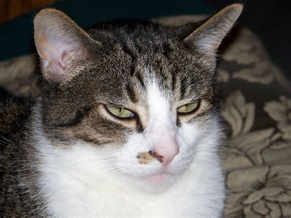

# About us

The FHIR Aggregator is an NCPI Interoperability Project that aims to collect metadata from existing open biomedical data from various NIH funded studies, translate it into FHIR format, and make it available for search. 

To learn more about how we make metadata ready for search, head to our [about our data](./ourdata.md) page.

## About the NCPI

The [NIH Cloud Platform Interoperability program:octicons-link-external-16:](https://www.ncpi-acc.org/){:target="_blank"} (NCPI) is a partnership between multiple NIH-supported participating systems (currently AnVIL, BioData Catalyst, CRDC, dbGaP, and Kids First) developing and implementing technical standards to enable interoperability and facilitate a federated data ecosystem.

## Our team

-   <figure>
    
    <figcaption>Kyle Ellrott
Principal Investigator - OHSU</figcaption>
</figure>

-   <figure>
    
    <figcaption>Amanda Charbonneau 
Principal Investigator - GDIT</figcaption>
</figure>

-   <figure>
    
    <figcaption>Borris Aguilar
Principal Investigator - ISB-CGC</figcaption>
</figure>

-   <figure>
    
    <figcaption>Brian Walsh 
Developer</figcaption>
</figure>

-   <figure>
    
    <figcaption>Nasim Sanati 
Developer</figcaption>
</figure>

-   <figure>
    
    <figcaption>Parker Gray 
Developer</figcaption>
</figure>

-   <figure>
    
    <figcaption>Lauren Hagen 
Bioinformatician</figcaption>
</figure>

## Funding

This project has been funded in whole or in part with Federal funds from the National Cancer Institute, National Institutes of Health, Task Order No. 17X053 under Contract No. HHSN261200800001E
